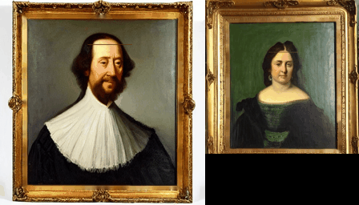

# Living Portraits — *A Life in the Frame*

A painting that decides what to do next. Not a video on a loop, a portrait with a
small brain that looks around inside itself, picks where it wants to be, and
remembers where it just was. It runs on two LED panels on Floor 10 of Frontier
Tower, San Francisco, at [Immersive Commons](https://www.immersivecommons.com).

## The idea in one paragraph

Each character is a **map**: a graph of poses (the places it can be) and moves (the
ways to get between them), in [`data/clips/video_graph.json`](data/clips/video_graph.json).
A slow brain picks a goal pose; a pathfinder walks the graph edge by edge to get
there. It keeps a **journal** of its own recent decisions and reads it back before
choosing again, which is what makes it read as alive instead of looping. Above all
of that sits a **clock**: at night it overrides the brain and the character goes to
bed. The order of command is literally `circadian.py` > `mind.py` > the random walk.

The thing that surprised us most: the hard problem was never the model, it was the
**shape of the map**. A character can want something perfectly and still look dead
if every pose is a dead end. Read the full story:
**[A Life in the Frame](https://www.immersivecommons.com/projects/a-life-in-the-frame)**

## Where to start reading the code

| File | What it is |
|---|---|
| [`data/clips/video_graph.json`](data/clips/video_graph.json) | **the map** — every pose (node) and move (edge) |
| [`director/heartbeat.py`](director/heartbeat.py) | **the brain** — reads the journal, picks goals (GLM) |
| [`runtime/mind.py`](runtime/mind.py) | LLM-intent layer over the walk |
| [`runtime/pathfind.py`](runtime/pathfind.py) | BFS over the graph toward a goal |
| [`runtime/circadian.py`](runtime/circadian.py) | the day/night clock that outranks the brain |
| [`prompts/`](prompts/) | the characters + the fourth-wall stage directives |

Open [`graph_viewer.html`](graph_viewer.html) in a browser to explore the map.

## What is and is not here

This repo is the **engine and the map**. The generated **media** (the Midjourney
poses and the clips between them) is not included, because a single character's
footage is gigabytes and it is yours to generate for your own characters. So you can
read exactly how it works, edit the graph, and run your own poses through it.

## Credits

Built by Ray and his AI agents at Immersive Commons. Portraits and motion made with
**Midjourney**. The brain runs on **GLM-5.1** with **Qwen3:8b** as stage manager,
self-hosted on one GPU and traced with OpenTelemetry to Langfuse. MIT licensed,
it is yours to take. Extend a character, and tell us what it taught you.
