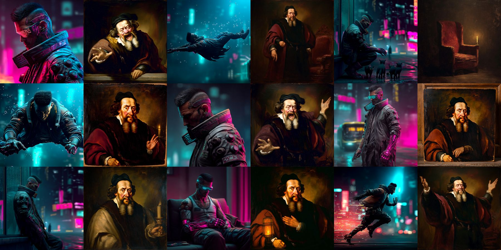
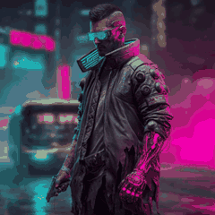
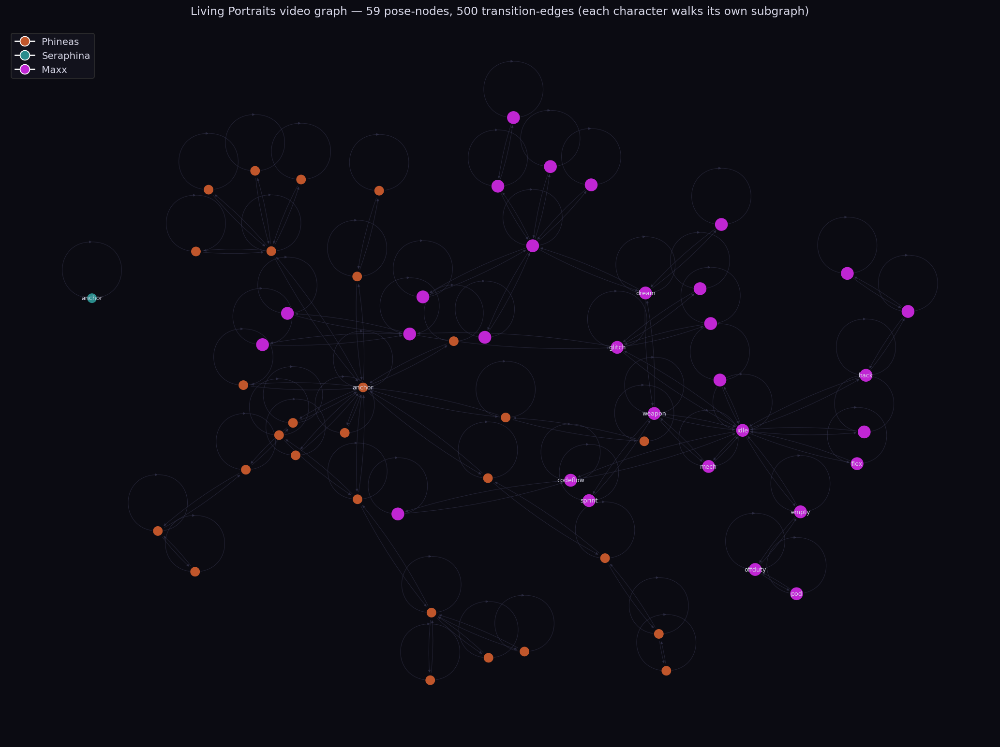

# Living Portraits

**A painting that thinks for itself.** Two AI portraits live on a wall at
[Immersive Commons](https://www.immersivecommons.com). They pick their own poses,
remember what they just did, and go to sleep at night. This is the open-source
engine that runs them.

**[Read the full story →](https://www.immersivecommons.com/projects/a-life-in-the-frame)**

## The two characters, walking their own graphs

| Maxx | Phineas |
|:---:|:---:|
|  |  |

## How it works

Each character is a **map** of poses and the moves between them
([`data/clips/video_graph.json`](data/clips/video_graph.json)). A slow brain
picks a pose it wants; a pathfinder walks the map to get there. It keeps a diary
of its own decisions and reads it back before choosing again, which is what makes
it feel alive instead of looping. At night, a clock overrides the brain and the
character goes to bed.

The surprise while building it: the hard part was never the model, it was the
**shape of the map**. A character can want something perfectly and still look
dead if every pose is a dead end.

## Start here

| File | What it is |
|---|---|
| [`data/clips/video_graph.json`](data/clips/video_graph.json) | the map — every pose and move |
| [`director/heartbeat.py`](director/heartbeat.py) | the brain — reads the diary, picks goals |
| [`runtime/pathfind.py`](runtime/pathfind.py) | walks the map toward a goal |
| [`runtime/circadian.py`](runtime/circadian.py) | the clock that outranks the brain |
| [`graph_viewer.html`](graph_viewer.html) | open in a browser to explore the map |

## What's here

The engine and the map. The generated **media** (the Midjourney poses and clips)
is not included, because a single character's footage is gigabytes, and it is
yours to make for your own characters.

## Credits

Built by Ray and his AI agents at Immersive Commons. Portraits and motion by
**Midjourney**; the brain runs on **GLM-5.1** with **Qwen3:8b** as stage manager.
MIT licensed — it is yours to take.
