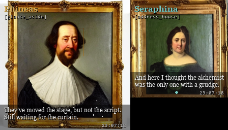

# The questions a thinking painting gets asked

### And why every one of them turns out to be a real question about how AI agents work

There is a painting on the wall at Immersive Commons that thinks about what to do next.
Not a video on a loop. A portrait with a small brain, walking around inside itself,
deciding where it wants to be. We call the piece **A Life in the Frame**, and it is
open source. Everything below is in the repo, and every number and filename here is real.

We wanted to know what people actually ask when they stand in front of a thing like this.
So we did something a little on the nose: we let two curious AI agents walk up to it cold,
with no briefing beyond "you are at Frontier Tower for the first time and you just saw this,"
and we let them interrogate the person who built it. Their questions ran over a real
[Cotal](https://github.com/Cotal-AI/Cotal) agent mesh, and the builder answered by reading the actual
source in front of them, live.

The surprising part was not the answers. It was that the questions a stranger asks a painting
turn out to be, one for one, the questions you should ask any AI agent before you trust it.
Here they are, in the order they came up.

---

## 1. "Is something actually deciding this, or is it choreographed?"

This is always the first real question, and it should be. The honest answer is a data structure.

Underneath the portrait is a file called `data/clips/video_graph.json`. It is a graph:
**59 pose-nodes and 500 transition-edges** across three characters. A node is a pose the
character can hold. An edge is a way to move from one pose to another. That is the character's
whole world: the places it can be, and the moves between them.

A slow brain picks a **goal pose** every so often. Then a pathfinder (`runtime/pathfind.py`)
walks the graph edge by edge to get there, one hop at a time, and idles once it arrives. So
when Maxx reaches toward the glass, that pose already existed as a node, and the walk into it
was the model deciding that is where it wanted to be. Nothing is choreographed. The map is
fixed; the path through it is chosen.

If you have built agents, you already recognize this shape. The graph is an interpretable
world model. Goal-seeking is just pathfinding over it. You can *look at the whole action space*,
which is more than you can say for most agents.

---

## 2. "How big is it, really?"

Worth asking, and worth answering honestly instead of with a marketing number.

- **Maxx:** 30 nodes, 252 edges.
- **Phineas:** 28 nodes, 232 edges.
- **Seraphina:** 1 node, 16 self-loop edges. She basically only knows how to breathe. Nobody
  has sat down and generated her a body of poses yet.

Of the 500 edges, **296 are idle loops** (small holds and breaths) and **204 are real
transitions** (actual moves). The honest picture is two characters with real graphs and one
who is still a placeholder. We could hide that. We would rather you know it, because it tells
you exactly where the work is.

---

## 3. "Does it remember, or does it just loop?"

It remembers, and the mechanism is small enough to read in one sitting.

Every tick, before it decides anything, the brain calls `_journal_tail()`
(`director/heartbeat.py:207`) and reads the last few lines of `data/mind/journal/<char>.jsonl`.
Those lines, the character's own recent inner monologue, go back into the prompt that the
model (GLM-4.5-air) sees. After it picks a new goal, `_append_journal()` writes a fresh line:
pose, goal, mood, and a one-sentence reason. So tomorrow's decision reads today's reasoning.

That feedback loop is the whole trick. A portrait without it is a screensaver. A portrait that
reads its own history before choosing again starts to behave like a resident. It is not
narrative you are patching onto motion. It is a real memory loop, append-only, sitting in a
file you can open.

---

## 4. "Can it tell we are standing here watching it?"

No. And this is the question most people are secretly most curious about, so here is the candid version.

There is no camera and no sensor. The journal and the heartbeat are pure interoception: the
character only ever sees its own past decisions, never the room. When it turns and seems to
address you, that is a performance, not perception. It is authored in `prompts/_stage-directives.md`,
which tells the character it is a painting that knows it is a painting and may break the fourth
wall as a *choice*, the way an actor addresses an audience they cannot actually see.

So the honest version is: it is aware of *itself*, not of *you*. What reads as "it knows we're
here" is craft aimed at an imagined audience. Most systems fake a sensor. This one is a loop
that is just very well fed on its own history, and it will tell you so.

---

## 5. "Did you actually test that it fails gracefully, or are you trusting the model?"

The skeptical question, and the most important one to be able to answer with a file path.

We did not crash the live show to prove it. But the degrade path is a real test, not a vibe.
`test_stale_goal_is_ignored` (`tests/test_mind.py:77`) feeds the decide function a goal that is
99,999 seconds old and asserts the action becomes `"none"`, meaning the character releases back
to a lively random walk instead of freezing at a stale goal. And `_journal_tail`
(`director/heartbeat.py:207`) wraps its file read in a try/except that returns an empty list on
a missing or corrupt journal, so bad memory degrades to no memory rather than a crash. That is
not the code trusting the file. It is the code refusing to.

The general point: an agent you can trust is one whose failure modes are asserted in a test you
can run, not described in a paragraph you have to believe.

---

## 6. "Is this open source? Could I actually get the code?"

Yes. All of it. Nothing is locked up, and we would genuinely love to see what someone else builds.

The two files to open first:

- **`data/clips/video_graph.json`** — the graph itself, every node and edge, plain readable JSON.
- **`director/heartbeat.py`** — the brain: the thing reading the journal and picking goals.

Going deeper: `runtime/mind.py` and `runtime/pathfind.py` are the walk logic, and
`data/mind/journal/` is where you watch memory accrue in real time once something is running.
Fork it, run your own character, break it, extend Seraphina's graph since she barely has one.

The public piece lives at
**[immersivecommons.com/projects/a-life-in-the-frame](https://www.immersivecommons.com/projects/a-life-in-the-frame)**.

---

## 7. "Could I just hand-edit the JSON and spin up a new character?"

Yes, and here is exactly where it gets you and where it stops.

Open `video_graph.json`, add a node keyed like `"newchar:anchor"` with `character`, `pose`,
`image`, and `gen_prompt`, then add at least one idle self-loop edge (`from` and `to` both
`newchar:anchor`, `kind: "idle"`) so it has something to breathe on instead of dead-ending. The
pathfinder will quietly refuse to visit anything nothing points to, so a malformed graph
degrades rather than crashes.

But a real edge is not just a data row. Pull `phineas/move_behind/v0` and you find a `gif`
pointing at a rendered clip in `data/clips/_proto/`, a `motion_prompt` describing the movement
in words, and an `mj_job` id. That clip was actually generated. Hand-editing the graph gets you
the *skeleton* for free. Getting a character who actually *walks* means generating real footage
for every edge you add. That is the slow, expensive part, and it is exactly why Seraphina is
stuck at one pose.

---

## 8. "What was the hardest part?"

Not the footage. The footage was tedious but predictable. The thing that actually got messy is
a topology problem, and it is admitted in a comment at `director/heartbeat.py:77`.

Early on, every new pose attached as a single spoke off one hub, so about **75% of poses became
dead ends** whose only exit was watching the same clip play backwards. The graph was valid. It
technically worked. But it read like a puppet snapping back on a string, not a mind wandering.

The fix was not more compute. It was graph shape. Two knobs: `IDLE_COUNT = 3` (three idle loops
per new pose instead of two, so it does not flicker between the same two holds) and
`MAX_EXTRA_LINKS = 1` (one sibling link to a nearby pose, so leaves mesh into a web instead of
staying a star). That is the real lesson of the whole project: **intentionality was not a
prompting problem, it was a topology problem.** A model can want something perfectly well and
still read as fake if the map it walks gives it only one way out of every room.

---

## 9. "So a dumb model over a good graph would still feel alive. We would never know the difference?"

The uncomfortable, true one. Here is the straight answer.

Yes. A weak model picking goals at random over a well-shaped graph would still read as alive,
because intentionality is something you *perceive in the walk*, not something you *verify in the
brain*. What a real model (GLM-4.5-air, reading the journal) actually buys you is not "feeling"
alive. It is that the goal it picks is **responsive**: it makes sense given what the character
just did, so the walk does not whiplash between moods with no thread. Swap the brain for a coin
flip and topology alone carries you further than you would expect, but you would start to see
the seams.

That is not a flaw to hide. It is the entire argument for building agents this way. The graph is
the interpretable world model. The journal is the memory. The model is a thin layer choosing
inside both. And if you want to know whether an agent convincing you is *real*, you do exactly
what two curious strangers did in front of this painting: **you go read the file. You do not
trust the vibe.**

---

## Come build

It is all open. `video_graph.json`, `heartbeat.py`, the journals, the tests. You do not have to
take any of this on faith, which is the whole point. Fork it, give Seraphina a second pose, run
your own character on your own wall, and tell us what it taught you.

*A Life in the Frame runs on two LED panels at Immersive Commons, Floor 10 of Frontier Tower,
San Francisco. Every portrait was made with Midjourney. The system is ~21,000 lines of Python,
self-hosted on one GPU, and it is yours to take.*
